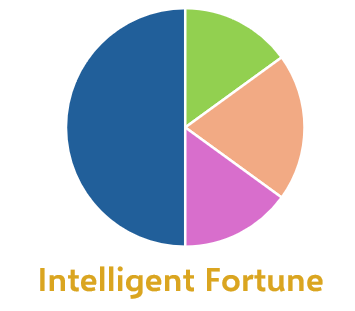

---
hide:
  - toc
---
# 👋 歡迎來到 CK Intelligent Fortune 數位花園

> ## 🧠 **「智慧獲取財富」**
> **「知識不是用來收藏的，而是用來連結與生長的。」**

# 請直接點擊下方分類，即可進入該領域的文章列表：

---
## [🤖 人工智慧 AI Business](AI Business/)
* [2026-02-03 伊隆馬斯克與SpaceX達成協議的超乎尋常的原因](AI Business/2026-02-03 伊隆馬斯克與SpaceX達成協議的超乎尋常的原因.md)
* [2026-02-03 2026 NVIDIA GTC](AI Business/2026-02-03 2026 NVIDIA GTC.md)
* [2026-01-31 路透：中國有條件批准DeepSeek購買輝達H200晶片](AI Business/2026-01-31 路透：中國有條件批准DeepSeek購買輝達H200晶片.md)
* [2026-01-30 OpenAI計劃在第四季進行IPO，試圖搶在Anthropic之前上市。](AI Business/2026-01-30 OpenAI計劃在第四季進行IPO，試圖搶在Anthropic之前上市。.md)
* [2026-01-30 OpenAI與英偉達價值1000億美元的巨額交易已被擱置](AI Business/2026-01-30 OpenAI與英偉達價值1000億美元的巨額交易已被擱置.md)

---
## [🤖 人工智慧 AI Infrasture](AI Infrasture/)
* [2026-01-30 開發商東京建物將投資6.5億美元在大阪建造資料中心，進軍資料中心領域。](AI Infrasture/2026-01-30 開發商東京建物將投資6.5億美元在大阪建造資料中心，進軍資料中心領域。.md)
* [2026-01-27 电力超级周期爆发，真正的机会不在发电端？](AI Infrasture/2026-01-27 电力超级周期爆发，真正的机会不在发电端？.md)
* [2026-01-24 追蹤「AI 巨頭、電力公司、監管機構 (FERC) 與政治角力」的複雜賽局](AI Infrasture/2026-01-24 追蹤「AI 巨頭、電力公司、監管機構 (FERC) 與政治角力」的複雜賽局.md)
* [2026-01-22 公用事業股需警覺。政治因素正開始侵蝕利潤](AI Infrasture/2026-01-22 公用事業股需警覺。政治因素正開始侵蝕利潤.md)
* [2026-01-20 Talen執行長：PJM備用電源拍賣可以填補巨大的電力供應缺口](AI Infrasture/2026-01-20 Talen執行長：PJM備用電源拍賣可以填補巨大的電力供應缺口.md)

---
## [🤖 人工智慧 AI Hardware & System](AI Hardware & System/)
* [2026-01-31 卡位AI PC！黃仁勳台灣尾牙鬆口：輝達攜手聯發科打造SoC](AI Hardware & System/2026-01-31 卡位AI PC！黃仁勳台灣尾牙鬆口：輝達攜手聯發科打造SoC.md)
* [2026-01-27 康宁美股盘前飙升超7%！报道：Meta拟豪掷60亿美元订购光纤，发力AI数据中心](AI Hardware & System/2026-01-27 康宁美股盘前飙升超7%！报道：Meta拟豪掷60亿美元订购光纤，发力AI数据中心.md)
* [2026-01-14 OpenAI與Cerebras達成數十億美元的運算合作關係](AI Hardware & System/2026-01-14 OpenAI與Cerebras達成數十億美元的運算合作關係.md)
* [2026-01-03 輝達 2026 年 CoWoS 需求觀察：Rubin 與 Blackwell 的產能配 置調整](AI Hardware & System/2026-01-03 輝達 2026 年 CoWoS 需求觀察：Rubin 與 Blackwell 的產能配 置調整.md)
* [2025-12-30 LPU 單元或許會透過台積電的混合鍵合（Hybrid Bonding）技術堆疊在下一代 Feynman GPU 上](AI Hardware & System/2025-12-30 LPU 單元或許會透過台積電的混合鍵合（Hybrid Bonding）技術堆疊在下一代 Feynman GPU 上.md)

---
## [📊 政治總體經濟 Politics & Economics](Politics & Economics/)
* [2026-01-31 由於需求疲軟，中國製造業採購經理人指數（PMI）再次跌入萎縮區間](Politics & Economics/2026-01-31 由於需求疲軟，中國製造業採購經理人指數（PMI）再次跌入萎縮區間.md)
* [2026-01-31 凱文沃許的三大任務：縮減聯準會規模、抑制通膨、管控總統](Politics & Economics/2026-01-31 凱文沃許的三大任務：縮減聯準會規模、抑制通膨、管控總統.md)
* [2026-01-30 聯準會主席沃什是如何在川普的終極真人秀中倖存下來的](Politics & Economics/2026-01-30 聯準會主席沃什是如何在川普的終極真人秀中倖存下來的.md)
* [2026-01-30 巴拿馬高等法院駁回香港港口營運商的訴訟，川普在運河問題上取得勝利](Politics & Economics/2026-01-30 巴拿馬高等法院駁回香港港口營運商的訴訟，川普在運河問題上取得勝利.md)
* [2026-01-29 美元走弱一直是川普計畫的一部分](Politics & Economics/2026-01-29 美元走弱一直是川普計畫的一部分.md)

---
## [📈 投資 Investment](Investment/)
* [2026-02-06 Qualcomm vs MediaTek](Investment/2026-02-06 Qualcomm vs MediaTek.md)
* [2026-02-06 POWL (POWELL) 投資價值 (update)](Investment/2026-02-06 POWL (POWELL) 投資價值 (update).md)
* [2026-02-06 GEV 投資價值 (update)](Investment/2026-02-06 GEV 投資價值 (update).md)
* [2026-02-06 Bloom Energy 投資價值](Investment/2026-02-06 Bloom Energy 投資價值.md)
* [2026-02-02 金銀投資指南：如何應對暴漲暴跌](Investment/2026-02-02 金銀投資指南：如何應對暴漲暴跌.md)

---
## [📟 半導體 Semiconductor](Semiconductor/)
* [2026-01-31 日本鎧俠公司擴大與閃迪的記憶體晶片合資項目，獲得10億美元投資](Semiconductor/2026-01-31 日本鎧俠公司擴大與閃迪的記憶體晶片合資項目，獲得10億美元投資.md)
* [2026-01-31 中國在全球前20大晶片製造設備供應商中佔據3席，排名略有上升](Semiconductor/2026-01-31 中國在全球前20大晶片製造設備供應商中佔據3席，排名略有上升.md)
* [2026-01-30 蘋果將在2026年優先推出高階iPhone，以應對記憶體短缺問題](Semiconductor/2026-01-30 蘋果將在2026年優先推出高階iPhone，以應對記憶體短缺問題.md)
* [2026-01-29 三星和SK海力士警告稱，記憶體晶片短缺問題將持續到2027年。](Semiconductor/2026-01-29 三星和SK海力士警告稱，記憶體晶片短缺問題將持續到2027年。.md)
* [2026-01-27 記憶體晶片短缺將在2026年對電視和消費性電子設備造成最嚴重衝擊](Semiconductor/2026-01-27 記憶體晶片短缺將在2026年對電視和消費性電子設備造成最嚴重衝擊.md)

---
## [🦾 機器人和電動車 Robotics & EV](Robotics EV & Automation/)
* [2026-01-23 馬斯克計劃明年向公眾發售人形機器人](Robotics EV & Automation/2026-01-23 馬斯克計劃明年向公眾發售人形機器人.md)
* [2026-01-16 分析顯示，中國在機器人和其他實體人工智慧專利方面領先全球。](Robotics EV & Automation/2026-01-16 分析顯示，中國在機器人和其他實體人工智慧專利方面領先全球。.md)
* [2026-01-15 電動車市場慘淡收場後，福特與中國比亞迪就混合動力車電池展開談判](Robotics EV & Automation/2026-01-15 電動車市場慘淡收場後，福特與中國比亞迪就混合動力車電池展開談判.md)
* [2026-01-14 Komatsu 財務長：受美國關稅衝擊加倍，公司將繼續漲價](Robotics EV & Automation/2026-01-14 Komatsu 財務長：受美國關稅衝擊加倍，公司將繼續漲價.md)
* [2026-01-02 深入了解伊隆馬斯克的擎天柱機器人項目](Robotics EV & Automation/2026-01-02 深入了解伊隆馬斯克的擎天柱機器人項目.md)

---
## [🪙 加密貨幣 Crypto](Crypto/)
* [2026-01-27 日本最快2028年批准加密貨幣ETF。](Crypto/2026-01-27 日本最快2028年批准加密貨幣ETF。.md)
* [2026-01-21 華爾街區塊鏈基建基金](Crypto/2026-01-21 華爾街區塊鏈基建基金.md)
* [2026-01-21 比特幣常被稱為「數位黃金」，但是非避險資產](Crypto/2026-01-21 比特幣常被稱為「數位黃金」，但是非避險資產.md)
* [2026-01-19 紐約證券交易所將推出全天候區塊鏈證券交易平台](Crypto/2026-01-19 紐約證券交易所將推出全天候區塊鏈證券交易平台.md)
* [2026-01-16 日本Resona和JCB將把穩定幣支付引入日常購物領域](Crypto/2026-01-16 日本Resona和JCB將把穩定幣支付引入日常購物領域.md)

---
## [🎨 生活與藝術 Life & Art](Life & Art/)
* [2026-01-31 日本外籍勞工人數首度突破250萬](Life & Art/2026-01-31 日本外籍勞工人數首度突破250萬.md)
* [2026-01-27 CEO們推崇五點起床，你未必適合](Life & Art/2026-01-27 CEO們推崇五點起床，你未必適合.md)
* [2026-01-23 日本將增加永久居留權語言能力要求](Life & Art/2026-01-23 日本將增加永久居留權語言能力要求.md)
* [2026-01-22 最新的遺產及贈與稅法修法草案](Life & Art/2026-01-22 最新的遺產及贈與稅法修法草案.md)
* [2026-01-22  滿世界飛的CEO們分享如何克服時差](Life & Art/2026-01-22  滿世界飛的CEO們分享如何克服時差.md)

---
