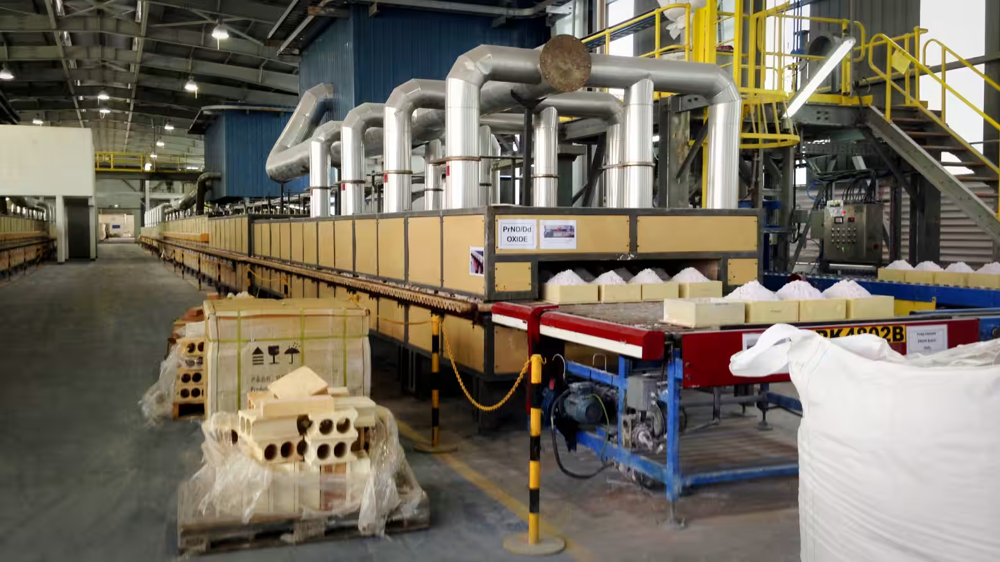
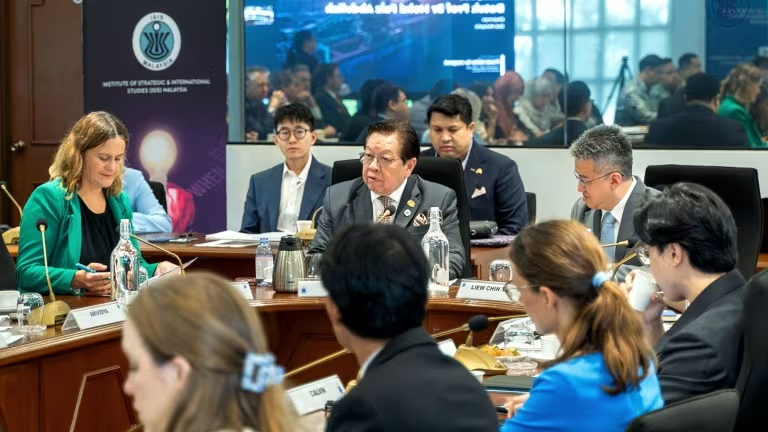

https://asia.nikkei.com/business/markets/commodities/malaysia-needs-to-move-up-rare-earth-value-chain-report-warns

這是一份針對 **馬來西亞稀土戰略轉型** 的 **投資銀行級情報簡報 (Investment Banking Grade Intelligence Briefing)**。

這則新聞揭示了 **全球科技供應鏈去風險化 (De-risking)** 的關鍵一環。馬來西亞試圖複製 **印尼的「鎳礦下游化」成功模式**，利用其作為「非中國最大精煉中心」的戰略地位，強行向上游整合。這將對電動車 (EV) 馬達與國防工業的供應鏈產生深遠影響。

---

### **新聞情報分析：馬來西亞的「稀土賭局」——從精煉代工轉向磁鐵製造**

#### **1. 新聞履歷 (Metadata)**

- **標題：** 馬來西亞尋求突破「中游陷阱」，力拚稀土磁鐵製造大國 (Malaysia warns of 'Midstream Trap', pivots to downstream magnet production)
    
- **來源/作者：** Nikkei Asia / Norman Goh
    
- **發布時間：** 2025年12月12日 (JST)
    
- **關鍵詞：** 萊納斯 (Lynas), 永久磁鐵 (Permanent Magnets), 鐠釹氧化物 (PrNd), 供應鏈韌性 (Resilience), 國庫控股 (Khazanah)
    

#### **2. 核心摘要 (Executive Summary)**

馬來西亞目前掌控全球 **5% 的稀土精煉產能**（僅次於中國的 88%），是西方世界最關鍵的稀土咽喉。然而，該國目前僅停留在「骯髒且低毛利」的精煉階段，缺乏高附加價值的「磁鐵製造」能力。

- **戰略目標：** 透過 2024 年實施的 **「原礦出口禁令」**（效仿印尼），強迫外資在當地設廠。目標是在 2050 年創造 224 億美元的 GDP 貢獻。
    
- **關鍵催化劑：** 澳洲礦商 **Lynas (萊納斯)** 與韓國 **JS-Link** 的合作，將建立首座年產 3,000 噸的磁鐵工廠。這是馬來西亞從「賣土」轉向「賣高科技組件」的轉折點。
    
- **瓶頸：** 聯邦與州政府的土地權限鬥爭（州政府想賣礦賺錢，聯邦想搞產業升級）、環境法規限制（大部分礦藏在森林保護區）。
    

位於馬來西亞格賓的澳洲礦業公司萊納斯先進材料工廠，稀土氧化物镨和釹的生產已進入最後階段。 © 路透社

馬來西亞ISIS公司董事長法伊茲·阿卜杜拉（圖中）在記者會上表示，未來十年將決定馬來西亞能否從稀土開採轉型為磁鐵製造並銷往全球市場。 （馬來西亞ISIS公司）

#### **3. 深度架構分析 (Structural Analysis)**

**A. 地緣政治：西方陣營的「磁鐵安全港」 (The Magnet Safe Harbor)**

- **現狀：** 中國不僅控制了開採和精煉，更控制了 **90% 以上的高性能釹鐵硼 (NdFeB) 磁鐵** 生產。如果你是 Tesla 或 Lockheed Martin，你有精煉好的稀土（來自馬來西亞），但還是得送回中國或日本做成磁鐵，這依然是斷鏈風險。
    
- **馬來西亞的角色：** 透過在精煉廠（Lynas 格賓廠）旁邊直接蓋磁鐵廠，馬來西亞試圖成為 **「非中國供應鏈 (China-Alternative Supply Chain)」** 的一站式樞紐。這符合美國與澳洲的國家安全利益。
    

**B. 產業經濟學：複製「印尼模式」的風險 (The Indonesian Playbook Risk)**

- **邏輯：** 印尼禁止鎳礦出口，成功逼出龐大的電池產業鏈。馬來西亞想對稀土做同樣的事。
    
- **難點：** 稀土開採的環境破壞性（放射性廢料）遠高於鎳礦。馬來西亞社會對 Lynas 的環保抗爭歷史悠久，這增加了擴大上游開採的政治風險（ESG Risk）。
    

**C. 投資邏輯：Lynas 的護城河加深 (Lynas's Moat Deepens)**

- **不可替代性：** 在這篇報導中，**Lynas 是唯一的「造王者 (Kingmaker)」**。馬來西亞若沒有 Lynas 的精煉技術和現成產能，其下游夢想只是空談。
    
- **轉型信號：** Lynas 往下游整合（磁鐵），意味著它將從一家「大宗商品礦商」轉型為「特種化學品與先進材料製造商」，其估值倍數 (Valuation Multiple) 理應提升。
    

#### **4. 投資專家的行動建議 (Actionable Insights)**

這對您的 **$20,000 資產配置** 或更廣泛的投資視野有何影響？

1. **關注稀土礦商 ETF (REMX) 中的「非中國」成分：**
    
    - **Lynas (LYC.AX / LYSDY)：** 這是最直接的受惠者。如果馬來西亞成功建立磁鐵聚落，Lynas 將擁有地利之便（省去運輸成本）。
        
    - **MP Materials (MP)：** 這是美國唯一的競爭對手。如果馬來西亞因為官僚主義或環保問題失敗了，MP 將成為西方唯一的希望，股價會受益。
        
2. **科技硬體的「通膨隱憂」：**
    
    - 馬來西亞的轉型期（禁止原礦出口但加工產能未到位）可能會導致短期內 **稀土氧化物 (PrNd Oxide)** 供應緊縮，推高價格。
        
    - 這會增加 **電動車馬達 (EV Motors)**、**風力發電機** 和 **AI 機器人伺服馬達** 的硬體成本。
        
3. **潛在的「主權財富基金」跟投機會：**
    
    - 文中提到馬來西亞國庫控股 (Khazanah) 正在尋找合作夥伴。這通常意味著會有由國家背書的合資企業 (JV) 出現，這類項目通常享有稅收優惠和政策保護，值得關注相關的上市公司合作方（通常是日本商社或韓國材料廠）。
        

---

總結：

馬來西亞正在試圖卡位 「AI 與綠能硬體」 的上游咽喉。如果成功，它將成為東南亞的「稀土磁鐵王國」；如果失敗，則全球供應鏈將更加依賴美國的 MP Materials 或被迫回頭依賴中國。

下一步：

既然談到了 MP Materials (MP) 與 Lynas (LYC) 的競爭關係，以及稀土對 AI 機器人 (Robot Actuators) 的重要性，您是否希望我分析：在人形機器人 (Tesla Optimus) 量產的情境下，哪一家稀土公司的供應鏈佈局更具優勢？

