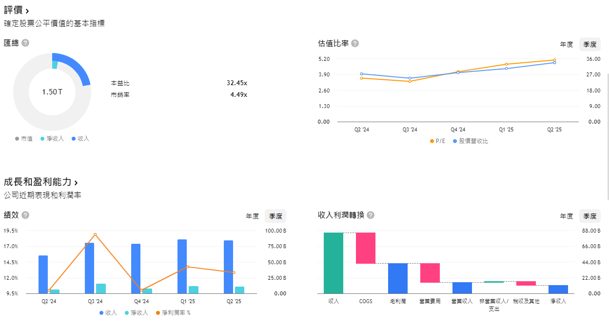
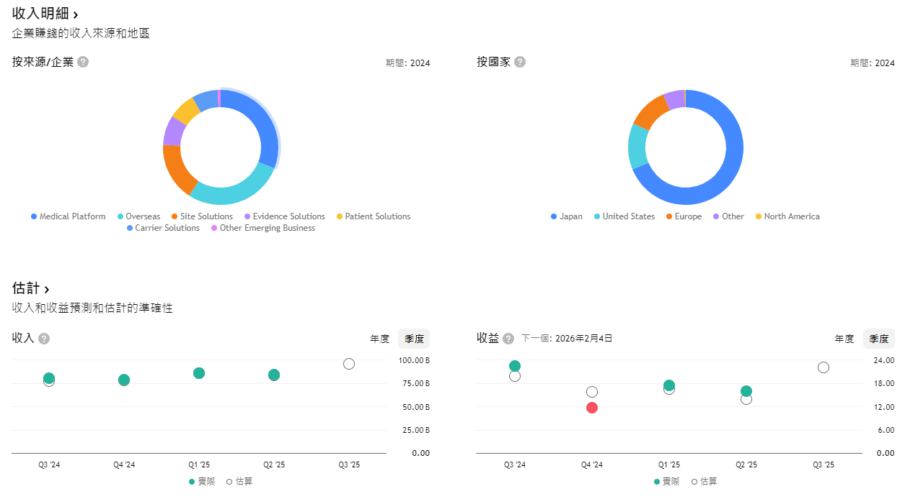

這是一份針對 **エムスリー株式会社 (M3, Inc., 2413.JP)** 的深度投資分析報告。

基於 2025 年第二季度（FY2025 Q2）財報、投資者簡報及股票回購公告，我將以資深科技投資專家與 CFP 的角度，為您拆解其未來潛力並構建估值框架。

---

### **1. 財務體質與業績總評：從「疫情特需」轉向「結構性擴張」**

M3 正在經歷一個關鍵的轉折點：從依賴 COVID-19 相關營收（疫苗接種支援、治療藥推廣）的爆發期，轉向透過併購（M&A）與生態系擴張的「正常化成長期」。

- **營收爆發但利潤率承壓：**
    
    - **營收：** 1,708 億日圓（YoY +36.9%）1。這是一個非常強勁的數字，主要受惠於併購（如株式会社エラン ELAN、株式会社イーウェル EWEL）及海外業務復甦。
        
    - **營業利益：** 359 億日圓（YoY +24.2%）2。
        
    - **關鍵觀察：** 雖然利潤雙位數成長，但營業利益率從去年的 23.2% 降至 21.0%。這反映了公司正在併入「低毛利、高營收」的實體運營業務（如福利厚生、患者支援），這稀釋了原本高毛利的互聯網平台業務。
        
- **非 COVID 業務的強勁反彈：**
    
    - 資料顯示，扣除 COVID 相關營收後，通常業務（Base Business）的成長率高達 **+38%** 3333。這證明其核心引擎（製藥行銷 DX、醫療現場 DX）並未熄火，且已填補了疫情紅利消失的缺口。
        

---

### **2. 未來潛力分析：三大成長引擎的虛與實**

M3 提出了「醫療版聖家堂（Sagrada Familia）」構想，意指永無止境的擴張。我將針對其三大支柱進行批判性分析：

#### **A. 醫療平台 (Medical Platform) - 核心現金牛**

- **現況：** 營收 519 億日圓 (+22%)，利潤 178 億日圓 (+22%) 4。
    
- **潛力：** 這是 M3 最強的護城河。日本醫師會員數突破 34 萬人（覆蓋率 90%）5。製藥公司在後疫情時代，MR（醫藥代表）數量持續減少（10 年減少 30%）6，這迫使藥廠必須依賴 M3 的「MR 君」等數位行銷工具。
    
- **挑戰：** 市場滲透率已高，未來的增長依賴單價提升與數據驅動的行銷（Data-driven marketing），成長爆發力可能趨緩。
    

#### **B. 海外業務 (Overseas) - 利潤增長的黑馬**

- **現況：** 營收 410 億日圓 (+8%)，**利潤 89 億日圓 (+34%)** 7。
    
- **潛力：** 利潤增速遠超營收增速，顯示北美與歐洲的業務體質正在改善。特別是北美的治験（臨床試驗）業務在經歷減損後開始復甦。
    
- **風險：** 資料中提到「川普影響風險注視中」8。美國醫療政策的變動（如藥價談判、FDA 審批速度）是最大的外部變數。
    

#### **C. 新領域 (Patient Solutions / White Jack) - 雙面刃**

- **現況：** 新設「Patient Solutions」部門（收購 ELAN），以及推進「White Jack Project」（預防醫療/福利厚生，收購 EWEL）。
    
- **潛力：** 這是將 TAM（潛在市場規模）從「醫療從業者」擴大到「一般大眾/員工」的關鍵戰略。覆蓋員工數已達 700 萬人 9。
    
- **挑戰：** 這些業務（如住院備品租賃、健檢代行）本質上是**勞力密集或低毛利**的。M3 能否利用數位能力（DX）顯著提升這些傳統業務的利潤率？這是估值能否重回高倍數的關鍵。
    

---

### **3. 估值分析與合理區間**

作為 CFP，我採用 **PER (本益比)** 與 **SOTP (分部加總法)** 的邏輯來評估。

- **2026 年 3 月期 (FY2025) 財測：**
    
    - 預估 EPS (每股盈餘)：**66.27 日圓** 10。
        
    - 歷史 PER 區間：過去 5 年 M3 的 PER 曾高達 100 倍以上（疫情泡沫），近期回落至 **28.5 倍** 左右 11。
        

#### **合理估值模型**

|**情境**|**假設邏輯**|**合理 PER 倍數**|**估算股價 (日圓)**|
|---|---|---|---|
|**保守 (Bear)**|併購整合不順，利潤率持續下滑，海外受美國政策打擊。市場將其視為「傳統醫療服務股」而非「科技股」。|20x - 22x|1,325 - 1,458|
|**中立 (Base)**|核心業務穩健增長 (+10-15%)，併購帶來營收堆疊但利潤率持平。市場給予「穩定成長股」評價。|**28x - 32x**|**1,855 - 2,120**|
|**樂觀 (Bull)**|"White Jack" 與 Patient Solutions 成功透過 DX 提升利潤率，海外業務利潤持續高成長。市場重燃對「醫療 AI/平台」的熱情。|40x - 45x|2,650 - 2,982|

- **目前股價位置：** 假設當前股價在 1,600-1,800 日圓區間（參考近期 PER 28.5x 左右），目前處於**「中立偏低」**的位置。
    
- **催化劑：** 公司宣佈了 **200 億日圓** 的股票回購計畫（至 2026 年 4 月）12，且截至 2025 年 11 月已執行約 33 億日圓 13。這顯示管理層認為目前股價被低估，且提供了下檔支撐。
    

---

### **4. 專家視角：給您的挑戰性提問 (The Challenge)**

針對這份資料，我建議您深入思考以下三個挑戰性問題，這決定了 M3 是否具備長期 Alpha（超額報酬）：

1. 利潤率的「地心引力」：
    
    「M3 正在大舉併購像 ELAN（住院租賃）、EWEL（福利厚生）這類傳統、低毛利的實體服務公司。請問管理層，具體的 PMI (併購後整合) 計劃是什麼？如何保證這些『重資產/重人力』業務不會長期拖累 M3 引以為傲的高 ROE（目前已降至 11.1%）14？」
    
2. 海外業務的護城河：
    
    「海外利潤雖然增長 34%，但營收受匯率影響。請問在美國市場，除了併購臨床試驗站點（Wake Research）外，M3 是否具備像日本『m3.com』那樣壟斷性的醫師平台影響力？如果沒有，海外業務是否容易受到價格戰衝擊？」
    
3. White Jack 的變現邏輯：
    
    「覆蓋 700 萬員工聽起來很棒，但目前的變現模式似乎仍停留在傳統的『B2B 簽約費』。請問是否有『數據變現』或『B2B2C（直接向員工收費）』的具體路徑？如果沒有，這塊業務的成長上限將受制於企業的福利預算。」
    

### **總結建議**

M3 是一家體質優良、現金流強勁（營運現金流 +362 億）15 的公司。目前的估值已經消化了疫情後的高基期影響。

- **投資屬性：** 適合 **GARP (Growth at a Reasonable Price)** 策略。不要期待它像 2020 年那樣翻倍，但作為醫療數位化的龍頭，它具備長期穩健向上的底氣。
    
- **操作策略：** 關注 PER 25 倍以下的積累機會，並密切監控 **ROE 是否能止跌回升**。

## 庫藏股回購

### **1. 庫藏股買回的平均價格**

根據 M3 公司於 2025 年 12 月 1 日發布的「自己株式の取得状況に関するお知らせ（庫藏股取得狀況公告）」文件 1，截至 2025 年 11 月 30 日的累計買回數據如下：

- **已買回總股數：** 1,600,100 股
    
- **已買回總金額：** 3,306,267,300 日圓
    

平均買回價格計算：

$$3,306,267,300 /div 1,600,100 /approx /mathbf{2,066.29 /text{ 日圓}}$$

專家的解讀：

您提到「買回速度非常慢」是正確的觀察。

- **進度落後：** 公司設定的買回上限是 **200 億日圓** 2，期限到 2026 年 4 月底。但在執行了約 7 個月後（5 月至 11 月），僅使用了約 **33 億日圓**，執行率僅約 **16.5%**。
    
- **價格敏感度：** 平均買回價 **2,066 日圓** 顯示公司在這個價位附近有進行吸籌，但並不急於追高。這可能意味著管理層認為股價在 2,000 日圓以上時，保留現金用於併購（M&A）的效益可能高於回購股票，或者他們在等待更低的價格區間進行更積極的護盤。
    

---

### **2. 本益比 (P/E) 30 倍所需的合理成長率**

作為 CFP 與投資專家，我們通常使用 **PEG 指標 (本益成長比)** 來評估高本益比成長股的合理性。

理論公式：

$$/text{PEG} = /frac{/text{本益比 (P/E)}}{/text{預期盈餘成長率 (Growth Rate)}}$$

- **標準與計算：**
    
    - **PEG = 1.0 (合理估值)：** 市場通常認為成長率應等於本益比。若 P/E 為 30 倍，理論上市場期待每股盈餘 (EPS) 每年要成長 **30%**。
        
    - **PEG = 1.5 ~ 2.0 (高品質溢價)：** 對於像 M3 這樣擁有強大護城河（平台壟斷性、高轉換成本）的龍頭企業，市場往往願意給予溢價。若以 PEG 1.5 計算，合理的成長率需求約為 **20%**。
        

**結合 M3 現況的分析：**

- **實際成長率：** 根據 FY2025 Q2 財報，M3 的營業利益年增率為 **+24.2%** 3，扣除 COVID 影響後的基礎業務營收成長率甚至高達 **+38%** 4。
    
- **結論：**
    
    - 目前的成長表現（約 24% 的獲利成長）對應 30 倍本益比，其 PEG 約為 $30 /div 24 = 1.25$。
        
    - **這是一個「合理偏低」的區間。** 對於一家數位醫療平台龍頭來說，只要能維持 **20% - 25%** 的複合成長率，就能支撐 30 倍的本益比。市場目前的定價並沒有過度高估，反而顯示出投資人對於其併購後能否維持高利潤率仍存有疑慮（這也是為何股價受到壓抑、公司買回速度慢的原因之一）。
        

總結建議：

公司在 2,066 日圓 均價進行回購，且目前成長率（24%）足以支撐近 30 倍的估值。若您相信其「非 COVID 業務」能持續保持 20% 以上的增長，目前的股價修正提供了不錯的長期佈局機會。

## 海外業務

根據 2025 年 3 月期第 2 四半期（FY2025 Q2）的財務報告和投資者簡報，以下是針對 M3 公司海外業務（特別是美國）的形態以及其獲利貢獻的分析：

### **1. 海外（特別是美國）的業務形態是什麼？**

M3 在海外的業務並非單純複製日本的「m3.com 醫師門戶網站」模式，而是透過併購（M&A）發展出了更多元、更深入實體運作的業務形態。在美國，其業務主要由以下三大支柱構成：

- **治験（臨床試驗）業務 (Clinical Trials)**：
    
    - **形態：** 不同於僅提供支援服務，M3 在美國透過子公司 **M3 Wake Research** 直接**運營治験實施設施（Clinical Trial Sites）** 1。
        
    - **特點：** 他們在美國擁有超過 10 個組織化的治験設施網絡，並與各地醫院合作，能直接接觸數十萬名患者 2。這讓 M3 能夠直接承接製藥公司或 CRO（受託研究機構）的治験項目，並利用其龐大的患者資料庫加速受試者招募（Patient Enrollment），解決治験中最耗時的痛點 3333。
        
- **醫師職涯與招聘服務 (Physician Career)**：
    
    - **形態：** 這是美國業務的另一大支柱。透過收購 **The Medicus Firm**、**PracticeMatch** 和 **NAS** 等公司，提供醫師獵頭、招聘營銷及招聘廣告服務 4444。
        
    - **特點：** 美國面臨嚴重的醫師短缺問題，因此醫療機構對於招聘的需求極高。M3 提供從「醫師轉職支援」到「醫療機構採用品牌營銷」的一站式解決方案 5。
        
- **商業智能與市場調查 (Business Intelligence)**：
    
    - **形態：** 透過 **M3 Global Research**，利用其擁有的全球最大規模醫師會員小組（Panel），為製藥公司提供藥品市場調查和現狀分析服務 6。
        
    - **特點：** 能夠進行跨國、大規模的定量與定性調查，支援製藥公司的全球戰略 7。
        

此外，在歐洲（如法國、德國），M3 還擁有 **VIDAL Group**，提供藥品情報資料庫及電子病歷（Weda）等診所 DX（數位轉型）服務 8888。

### **2. 為什麼海外的獲利佔有很大一部分？**

根據最新財報（2025 年 3 月期 Q2），海外業務的獲利表現非常亮眼，其背後原因如下：

- **獲利貢獻數據：**
    
    - **營收：** 410 億日圓（約佔總營收的 24%）9。
        
    - **營業利益：** 89 億日圓（約佔總營業利益的 25%）10。
        
    - **成長率：** 海外部門的利益年增率高達 **+34.5%**，是所有部門中成長最快的之一 11。
        
- **獲利佔比大的原因分析：**
    
    1. 北美治験業務的復甦與改善：
        
        前一年度北美治験業務曾因市況不佳而計提減損損失，但本季度這部分負面影響已經剝落，且業務本身營收雖然受匯率影響（日圓升值），但實質上正在改善，利潤率顯著回升 12121212。
        
    2. 市場規模與併購策略（Programmatic M&A）：
        
        美國和歐洲的醫療市場規模遠大於日本。M3 透過積極的「程式化併購」策略，快速獲取了當地的關鍵資產（如美國的治験站點和招聘公司）。這些被收購的企業在融入 M3 生態系後，往往能提升營運效率並貢獻穩定現金流 13131313。
        
    3. 歐洲與亞太地區的強勁增長：
        
        除了美國，歐洲（特別是法國和英國）以及亞太地區（如 APAC 的 Limbic 收購貢獻）的業務表現堅挺，營收分別成長了 15% 和 12% 14。這分散了單一市場的風險並堆疊了利潤。
        
    4. 高單價與剛性需求：
        
        美國的醫療服務單價較高，且醫師短缺帶來的招聘需求是剛性的。這使得 M3 在美國的職涯服務能維持不錯的獲利能力 15。
        

總結：

M3 的海外業務之所以能佔據獲利的重要版圖，是因為它成功地將業務從單純的「線上行銷」拓展到了美國利潤豐厚的「實體治験運營」與「醫療人才招聘」領域，並透過全球併購持續擴大版圖。近期獲利的大幅增長，更是得益於北美治験業務的體質改善與歐洲業務的穩健擴張。

###  川普政策可能會影響到哪一個業務？

根據 M3 最新的 2025 年第二季度財報說明會資料，公司明確指出的風險點在於**「海外事業（Overseas）」**中的**「北美治驗（臨床試驗）業務」**。

- **具體影響點：** 財報資料中提到「針對北美的治驗業務，正在密切注視川普政權帶來的影響風險」。
    
- **潛在邏輯：** 川普過去曾多次提及降低藥價、以及對醫藥研發（R&D）流程的監管變動。如果美國政策導致製藥公司縮減研發預算或改變新藥審批流程（FDA 政策變動），將直接衝擊 M3 在美國擁有實體運營的 **Wake Research**（治驗設施網絡）的訂單量與執行進度。
    

###  M3 的商業模式有可能在台灣執行嗎？

**答案是肯定的，而且 M3 已經在台灣執行中。**

雖然「m3.com」這個網站主要針對日本，但 M3 集團透過其收購的子公司 **MIMS**，已經在台灣建立了穩固的業務版圖。

- **執行現況 (Via MIMS)：**
    
    - M3 於 2015 年收購了亞洲最大的醫療資訊出版商 MIMS。
        
    - **MIMS Taiwan**（MIMS 台灣分公司）目前在台北設有辦公室，其業務模式與 M3 日本核心業務高度相似，包括：
        
        - **藥品資訊平台：** 台灣醫師與藥師廣泛使用的藥品查詢工具（類似 m3.com 的資料庫功能）。
            
        - **製藥行銷支援 (Medical Marketing)：** 協助國際藥廠在台灣進行學術推廣、多通路行銷（MCM），解決藥廠業務代表（MR）無法覆蓋所有醫師的問題。
            
- **台灣市場的適配性分析：**
    
    - **高醫療水準：** 台灣擁有世界級的醫療服務體系與全民健保資料庫，這與 M3 擅長的「數據驅動行銷」與「真實世界數據（RWD）研究」高度契合。
        
    - **醫師數位化程度高：** 台灣醫師對數位工具接受度極高，有利於推廣類似「MR 君」的數位行銷工具。
        
    - **政策推力：** 台灣政府近期投入預算強化「醫療韌性」與在地藥品生產，這將帶動更多藥品上市與行銷需求，為 M3/MIMS 的商業模式提供成長土壤。
        

總結：

川普風險主要集中在美國的臨床試驗業務；而 M3 的商業模式不僅適合台灣，且早已透過 MIMS 落地生根，利用台灣發達的醫療體系進行數位行銷與醫療資訊服務。