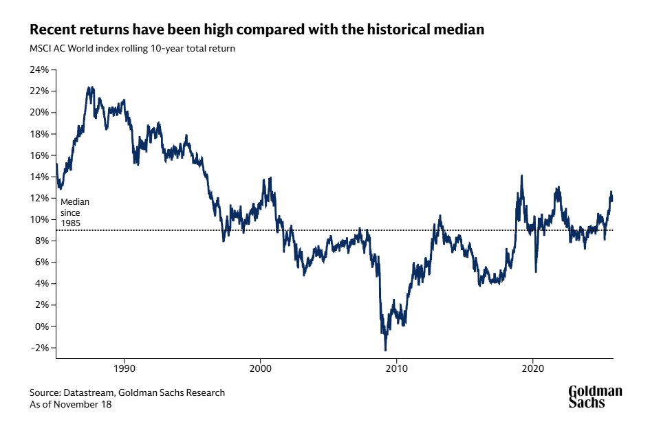
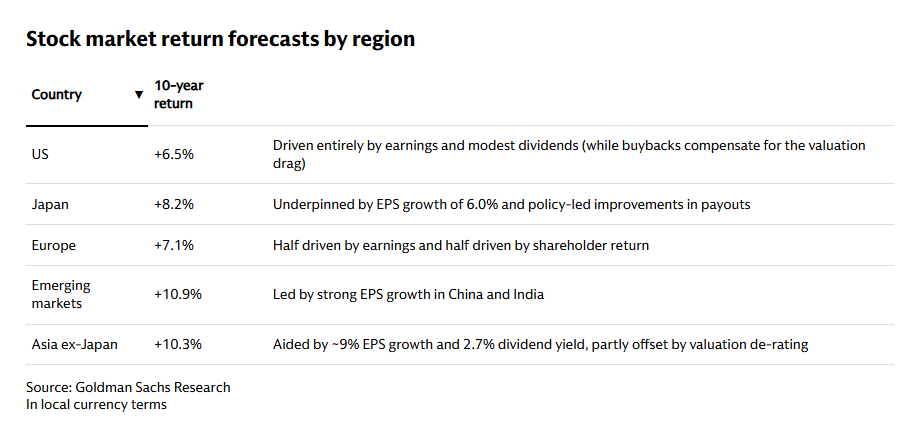

# 
https://www.goldmansachs.com/insights/articles/global-stocks-are-forecast-to-return-7-point-7-percent-annually-in-coming-decade?utm_source=chatgpt.com

這篇文章應該是Peter Oppenheimer(高盛研究部的首席全球股票策略師Chief Global Equity Strategist in Goldman Sachs Research）團隊的研究。

2025-11-23 23:55

---

## 重點摘要 (Key Takeaways)

高盛研究預測，未來十年全球股市以美元計價的年化回報率將達到 **7.7%**。

1.  **回報驅動因素 (Return Drivers):** 股市表現的結構性驅動因素包括：**名義GDP增長**、**盈利能力**和**股東分配**（股利和回購）。
2.  **回報構成 (Return Composition):**
    * **盈利增長**（包括股票回購）被視為主要引擎，預計每年複合增長約 **6%**。
    * 其餘回報將由**股利**提供。
    * 預計目前偏高的**股票估值**將適度回落。
3.  **歷史對比 (Historical Context):** 7.7% 的預測低於1985年以來 **9.3%** 的長期平均值，但與2000年以來的年化回報率持平。
4.  **估值判斷 (Valuation Stance):**
    * 當前全球股票估值**偏高**（約為19倍遠期市盈率）。
    * 高盛預計估值在未來十年將略微下降。
    * 儘管估值高，但部分合理性可歸因於**結構性更高的利潤率**和**股東權益報酬率 (ROE) 的改善**，這減輕了傳統指標（如CAPE）暗示的較低回報風險。
5.  **區域建議 (Regional Tilt):** 建議投資者**分散投資**，超越美國市場，並傾向於**新興市場**，理由是新興市場具有更高的名義GDP增長和結構性改革的潛力。
6.  **貨幣影響 (Currency Effect):** 預計美元明年將走弱，這將在未來12個月內為全球股市（以美元計價）額外貢獻約 **0.6%** 的總回報。

### Which stock markets are forecast to have the best returns?

---

## 資深股市投資專家視角分析 (Analysis from a Seasoned Stock Investment Expert)

從一位資深的全球股市投資專家角度來看，高盛的這份報告是一份**務實且具有指導意義的基線預測**，但其核心假設，特別是關於盈利增長和區域表現的假設，值得深入探討。

### 1. 對 7.7% 預測的評估：合理且保守的基線

7.7% 的預期年化回報是一個**中性偏低的預測**。這是一個在當前高估值環境下，給予投資者的**合理預期**，避免了過度樂觀。

* **優勢（務實）：** 報告坦承預計估值會「適度回落」（即市盈率下降，**估值成為逆風**），這表明高盛並未假設當前的牛市估值會持續擴大，這是一種**保守且負責任**的觀點。
* **潛在風險：** 雖然報告提出「結構性更高的利潤率和改進的ROE」來為高估值辯護，但投資專家深知，如果未來的盈利增長（預期的6%）未能兌現，或是利率環境持續緊縮，**估值回落的速度**可能會比「適度」更快，從而侵蝕大部分回報。

### 2. 核心增長引擎的質疑：6% 盈利增長

報告指出 **6% 的年化盈利增長**是回報的主要來源。這項假設是整個預測的**基石**，必須被嚴格審視：

* **長期可行性：** 考慮到全球人口增長放緩，以及已開發市場趨於成熟，要實現連續十年 **6%** 的複合盈利增長（剔除通脹後仍是一個可觀的數字），需要**持續的技術創新**和**效率提升**。投資專家會問：這6%的增長是平均分配給所有行業和地區，還是高度集中在美國的科技巨頭？如果繼續集中，那麼「分散投資」的建議將難以產生效果。
* **回購納入的透明度：** 盈利增長「包括回購」是一個重要細節。股票回購能增加每股盈利 (EPS)，但不等同於實際的企業利潤增長。過度依賴回購來達成6%目標，可能意味著**基本面的有機增長壓力較大**。

### 3. 最具爭議的觀點：轉向新興市場與非美地區

報告建議投資者「分散投資，並傾向於**新興市場**」，這是**最具策略意義但也最具執行挑戰性**的建議：

* **經典理論與現實的鴻溝：** 投資專家對「新興市場將因高名義GDP和結構性改革而表現優異」的論點非常熟悉。這是一個**數十年來常常落空**的投資論點。新興市場的回報往往被**政治風險、公司治理問題、貨幣波動**以及**改革執行不力**所抵消。
* **美元貶值的催化劑：** 預期美元走弱確實是增加非美資產回報的一個**強大短期催化劑**。如果美元貶值幅度大於0.6%，這個多元化策略的吸引力將大幅提升。然而，貨幣預測的準確性歷來難以把握。
* **AI 的「寬泛效益」假設：** 報告假設人工智慧（AI）的長期效益將是「寬泛的，而非僅限於美國科技股」。這是支撐非美投資論點的關鍵。如果AI紅利真的能擴散至歐洲、日本和新興市場的傳統行業，那麼分散投資的策略將成功；但如果AI優勢仍被美國少數科技巨頭壟斷，那麼這項建議將會誤導投資人。

### 結論與實戰建議

總體而言，這份高盛報告為未來十年設定了一個**合理的預期錨點（7.7%）**。作為資深投資專家，我會將此預測視為一個**需要積極管理的基準**，而非被動接受的保證：

1.  **專注於盈利質量 (Quality of Earnings):** 投資組合應優先考慮那些能持續產生 **6% 以上有機盈利增長**的公司，而不僅僅是依賴回購來粉飾EPS的公司。
2.  **謹慎執行區域轉換 (Cautious Regional Rotation):** 雖然分散投資是明智之舉，但在配置新興市場時，必須**精選國家和公司**，尋找那些**真正執行了結構性改革**、具有良好公司治理且能夠有效利用 AI 等技術提升生產力的市場（例如，特定亞洲市場），而非盲目追蹤整個新興市場指數。
3.  **保持現金彈性 (Maintain Flexibility):** 由於報告承認當前估值偏高，投資專家應**保持一定的現金或流動性**，以便在市場因不可預見的風險（如地緣政治或經濟衰退）而出現估值大幅修正時，能夠利用修正帶來的機會。估值雖然不是全部，但確實是一個長期回報的「逆風」。

## **分析**Goldman Sachs全球股票回報預測的**深度解析**（包括模型邏輯、大型前提、潛在盲點和投資含義）。

## 🧐 深度解析與專家評估 (In-Depth Analysis and Expert Assessment)

### 1. 核心意義與模型解讀 (Core Meaning and Model Interpretation)

高盛這份報告的核心意義是：在**高估值且具備結構性優勢**的市場中，**主動管理的長期投資仍有合理回報**，但回報結構將發生根本性轉變。

#### 模型的戰略定位 ($7.7/% = 6/% + 1.7/% - /text{Contraction} + /text{FX}$)

* **避開極端預期：** 報告巧妙地避開了兩個極端：一是泡沫破裂論（回報 $< 5/%$），二是估值繼續擴張論（回報 $> 9.3/%$）。它提供了一個在當前環境下**具備說服力的「甜蜜點」**，即 $7.7/%$。
* **回報結構的轉變：** 報告最關鍵的洞察是：「未來十年不是由**估值推動（Valuation-driven）**的市場，而是由**盈利推動（Earnings-driven）**的市場。」它明確告訴投資者，不要期望股價在短期內暴漲，而是要享受慢牛的盈利複利。

### 2. 預設前提的合理性評估 (Assessment of Underlying Assumptions)

高盛的推論建立在一些必要但**具有高難度**的假設之上。

| 預設前提 | 專家評估 | 風險/合理性 |
| :--- | :--- | :--- |
| **名目 GDP 維持 $5/%-6/%$ 成長** | **合理性：中高。**這是 $6/%$ EPS 增長的基礎。考慮到通脹（$2/%-3/%$）和實際 GDP 增長（$2/%-3/%$），總和 $5/%-6/%$ 是可達成的基準情境。 | **風險：** 債務負擔與人口老齡化可能拖累實際增長，若名目 GDP 僅 $4/%$，則 $6/%$ EPS 目標將崩塌。 |
| **利潤率維持高檔（不回到低點）** | **合理性：關鍵。**高盛以此來為 $/text{19x PE}$ 辯護。企業的結構性優勢（如科技壟斷、AI 效率）是維持高利潤率的唯一理由。 | **風險：** 勞方議價能力回升、政府反壟斷法規、以及全球最低稅負制($/text{15/%}$)的實施，都將**直接侵蝕**利潤率，這是最大的結構性威脅。 |
| **高估值只是緩降（沒有崩盤）** | **合理性：中高。**假設央行能成功實現**軟著陸**，且地緣政治風險可控。市場的**流動性衝擊**和**硬著陸**才是導致估值崩盤的主因。 | **風險：** 這是市場對「利率將逐步下降」的共同信念。一旦長期利率重新攀升（如$5/%$以上），$/text{19x PE}$ 必然會加速下修。 |

### 3. 潛在盲點與深度分析 (Potential Blind Spots and In-Depth Analysis)

您提出的四個盲點均擊中要害，是資深投資者應重點關注的風險所在。

#### 盲點 A：EPS $6/%$ 長期成長是否高估？

* **專家的論點：** 歷史數據顯示 $/text{EPS}$ 長期平均 $3/%-4/%$ 才是常態。高盛的 $6/%$ 假設必須包含**極高的回購力度**，且**美股必須延續過去十年的相對強勢**。
* **關鍵警示：** 如果 $/text{EPS}$ 成長率實際掉到 $4/%$（歷史平均），則回報將變成 $/text{4/%} + /text{1.7/%} - /text{Valuation Contraction} /approx 5.5/%$ 左右，與 $7.7/%$ 差距甚遠。這就是**樂觀情境**與**常態情境**的主要區別。

#### 盲點 B：利潤率可能已經見頂

* **專家的論點：** 這不是可能，而是**高概率事件**。美國企業利潤率處於歷史頂峰，是過去十年美股碾壓全球的**單一最大原因**。
* **投資含義：** 投資者應極度警惕**利潤率的均值回歸**。 $/text{AI}$ 固然能提升效率，但其效益是否能大過全球稅負協調、工資上漲和**巨額 $/text{CapEx}$ 帶來的折舊**，仍是未知數。一旦利潤率小幅下降，$/text{6/% EPS}$ 增長將難以維持。

#### 盲點 C：全球股市的 $/text{AI}$ 願景是否過度集中？

* **專家的論點：** 高盛建議**「分散配置」**，同時說 $/text{AI}$ 收益會是**「廣泛的」**，這兩者是相互支撐的論點。但現實情況是 $/text{AI}$ **贏家通吃**的趨勢非常明顯。
* **投資含義：** 如果 $/text{AI}$ 邊際利潤依然主要集中在美國和極少數亞洲的供應鏈領導者，那麼美國股市的**主導地位將會繼續**，非美地區的 $7.7/%$ 回報預期將難以實現。專家的做法是：**謹慎分散**，挑選真正能從 $/text{AI}$ **應用端**獲益的非美企業，而不是廣泛投資。

#### 盲點 D：美元走弱的預測常常不準

* **專家的論點：** 匯率是最難預測的變量。美元的強勢是結構性的（高流動性、避險資產、美國科技創新）。
* **潛在風險：** 報告將 $/text{FX}$ 貢獻的 $0.6/%$ 視為淨增益，但如果美元反常走強（例如因全球地緣政治風險或美國高息環境維持），這 $0.6/%$ 將變成**負貢獻**，使總回報降至 $7/%$ 甚至更低。

### 4. 實際投資含義與重點結論

這份報告是對長期投資者的**「價值訊號」**，而非短期交易者的操作指南。

1.  **市場屬性：EPS Driven Slow Bull Market**
    * 投資的**重心**必須從尋找「被低估的股票」（$/text{Valuation}$ 擴張）轉向尋找「持續盈利擴張的股票」（$/text{EPS}$ 增長）。
    * **選股優於擇時。**在 $7.7/%$ 的慢牛預期下，企業的**盈利質量和結構性護城河**比宏觀經濟的波動更重要。

2.  **地區配置：擇優而非全面轉移**
    * 建議轉向**新興市場**，應視為一個**戰術性機會**，而非全面戰略。應關注**受益於去全球化供應鏈重組**或**結構性改革確實發生**的國家（例如印度、墨西哥、特定東南亞地區），而非廣泛押注整個 $/text{EM}$ 指數。

3.  **合理區間與風險敞口**
    * 我認同您 $5.5/% /sim 7.5/%$ 的**更可能的區間**。
    * $7.7/%$ 屬於**「最佳情境下的基準預測」**。投資者應該以 $5.5/%-6/%$ 為基準，將高盛提出的 $/text{FX}$ 收益和 $/text{AI}$ 廣泛收益視為**潛在的額外上行空間**。

---
好的，樂意之至。我將為您建立一個**全球股市未來十年年化回報的五個情境分析模型**，明確指出每個情境的核心假設，特別是關於 $/text{EPS}$ 增長、利潤率和估值變化的預期。

## 📊 全球股市未來十年回報：五大情境分析模型

此模型基於高盛報告的分解邏輯：$/text{Total Return} /approx /text{EPS Growth} + /text{Dividend Yield} - /text{Valuation Contraction}$

假設股息貢獻（Dividend Yield）在所有情境中大致穩定在 $1.7/% /sim 2.0/%$（為簡化計算，我們取 $/mathbf{1.8/%}$ 作為基準）。

### 情境一：**超樂觀牛市 (Roaring Bull Case)**

| 項目 | 預期回報 | 9.0% |
| :--- | :--- | :--- |
| **核心假設** | $/text{EPS}$ 增長 $/mathbf{8.0/%}$ | 利潤率持續擴張（AI紅利巨大且集中），名目 $/text{GDP}$ 衝上 $/text{7/%}$。 |
| **估值變化** | 估值不變或略微擴張（$/mathbf{0/%}$ 壓力） | 利率持續維持低檔，市場願意為 $/text{AI}$ 帶來的爆炸性生產力支付更高溢價。 |
| **主要驅動力** | 美國科技股繼續強勢，$/text{AI}$ 收益滲透至全球，地緣政治風險大幅降低。 |
| **可能性** | **低** |

### 情境二：**高盛基準情境 (Goldman Sachs Base Case)**

| 項目 | 預期回報 | 7.7% |
| :--- | :--- | :--- |
| **核心假設** | $/text{EPS}$ 增長 $/mathbf{6.0/%}$ | 名目 $/text{GDP}$ 約 $/text{5/%-6/%}$，利潤率維持在高檔（被 $/text{AI}$ 效益抵消 $/text{CapEx}$ 成本）。 |
| **估值變化** | 估值**小幅收縮**（$/mathbf{-0.1/%}$ 壓力/年） | $/text{19x PE}$ 緩降至約 $/text{17x}$。市場軟著陸，利率逐步下降。 |
| **主要驅動力** | $/text{EPS}$ 成為主要動力，美元走弱帶來額外 $/text{FX}$ 收益（假設 $/text{0.6/%}$ 貢獻）。 |
| **可能性** | **中等** |

### 情境三：**中性/歷史平均情境 (Neutral/Historical Average Case)**

| 項目 | 預期回報 | 6.0% |
| :--- | :--- | :--- |
| **核心假設** | $/text{EPS}$ 增長 $/mathbf{4.5/%}$ | 利潤率開始**小幅均值回歸**（稅務、勞動力成本上升），$/text{EPS}$ 增長略高於歷史平均 $/text{3/%-4/%}$。 |
| **估值變化** | 估值**溫和收縮**（$/mathbf{-0.3/%}$ 壓力/年） | $/text{19x PE}$ 緩降至約 $/text{15x}$。$/text{FX}$ 收益為中性。 |
| **主要驅動力** | 盈利增長來自於全球經濟的平均增長，但高估值和利潤率壓力抵消了部分收益。 |
| **可能性** | **高** |

### 情境四：**悲觀但非崩潰情境 (Pessimistic but Non-Crash Case)**

| 項目 | 預期回報 | 4.0% |
| :--- | :--- | :--- |
| **核心假設** | $/text{EPS}$ 增長 $/mathbf{3.0/%}$ | 名目 $/text{GDP}$ 低於 $/text{4/%}$。利潤率**明顯回歸**至歷史低點。全球化逆轉導致企業成本大幅上升。 |
| **估值變化** | 估值**加速收縮**（$/mathbf{-0.8/%}$ 壓力/年） | $/text{19x PE}$ 降至約 $/text{12x}$。長期利率保持高檔。 |
| **主要驅動力** | 經濟陷入長期滯脹或溫和衰退。高估值未能被任何 $/text{AI}$ 紅利所支撐。 |
| **可能性** | **中低** |

### 情境五：**大衰退/危機情境 (Severe Recession/Crisis Case)**

| 項目 | 預期回報 | 0% - 2% |
| :--- | :--- | :--- |
| **核心假設** | $/text{EPS}$ 增長 $/mathbf{0/%}$ 或負增長 | 發生全球性金融危機、主權債務危機或大規模地緣政治衝突（如供應鏈完全中斷）。 |
| **估值變化** | 估值**劇烈崩盤**（$/mathbf{-1.6/% /sim -2.0/%}$ 壓力/年） | $/text{PE}$ 崩潰至個位數（如 $/text{8x-10x}$），市場流動性極度緊縮。 |
| **主要驅動力** | 重大資本市場結構性破壞。企業盈利消失，所有回報都來自股息，但被股價大幅下跌抵消。 |
| **可能性** | **低** |

---

### 💡 專家觀點摘要

| 專家建議 | 核心洞察 |
| :--- | :--- |
| **最可能區間** | 您的分析與我的觀點一致，**情境三 $/mathbf{(6.0/%)}$** 最接近長期的歷史平均和當前的高估值壓力，是**最具防禦性的基線**。 |
| **高盛的偏向** | 高盛的 $/text{7.7/%}$ 選擇了**情境二**，這暗示他們對 $/text{AI}$ 帶來的利潤率和生產力提升，以及全球經濟避免硬著陸，**抱持著審慎的樂觀態度**。 |
| **投資策略** | 作為投資者，應以**情境三 $/mathbf{(6.0/%)}$** 作為**你的預期回報基準**，並將**情境二 $/mathbf{(7.7/%)}$** 視為透過**主動選股**和**精準區域配置**所能爭取的上行目標。 |

您想進一步討論，在 $/text{6.0/%}$（中性）的情境下，投資者應該如何**分配其資產到不同區域**（美國、新興市場、歐洲）以優化回報嗎？